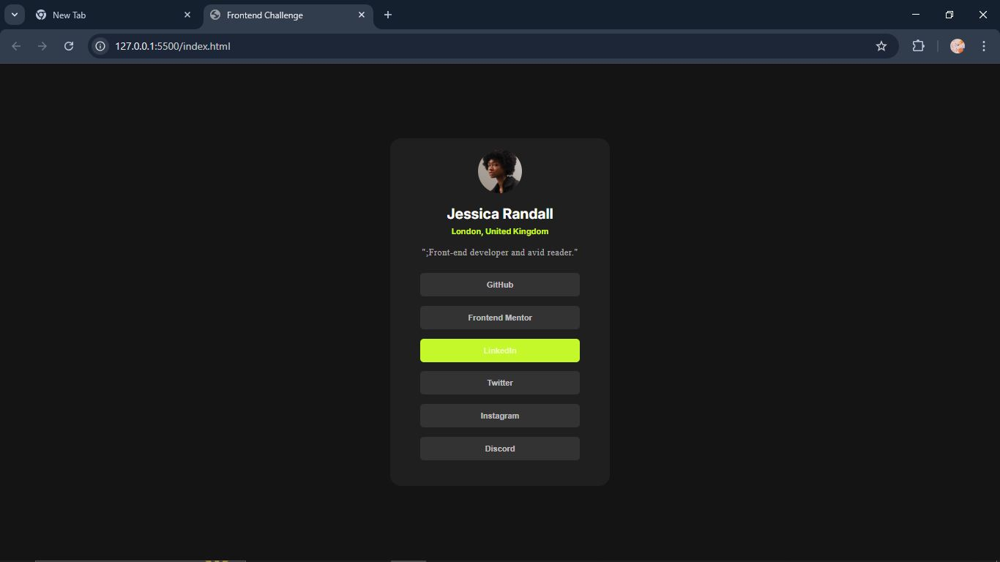

# Frontend Mentor - Social links profile solution

This is a solution to the [Social links profile challenge on Frontend Mentor](https://www.frontendmentor.io/challenges/social-links-profile-UG32l9m6dQ). Frontend Mentor challenges help you improve your coding skills by building realistic projects. 

## Table of contents

- [Overview](#overview)
  - [The challenge](#the-challenge)
  - [Screenshot](#screenshot)
  - [Links](#links)
- [My process](#my-process)
  - [Built with](#built-with)
  - [What I learned](#what-i-learned)
  - [Continued development](#continued-development)
  - [Useful resources](#useful-resources)
- [Author](#author)
- [Acknowledgments](#acknowledgments)


## Overview

### The challenge

Users should be able to:

- See hover and focus states for all interactive elements on the page

### Screenshot




### Links


## My process

### Built with

- Semantic HTML5 markup
- CSS custom properties
- Flexbox
- CSS Grid
- Desktop-first workflow
- JavaScript


### What I learned

I learnt how to use javaScript to 
- To append a list item to the existing list 
- To add an active class to an individual list item which when clicked, removes the class from other list items


```javaScript
const socialList = document.querySelector('.socialList');
const newListItem = document.createElement('li');

newListItem.textContent = "Discord";

socialList.appendChild(newListItem);
socialList.style.cursor = 'pointer';
socialList.addEventListener('click', (event) =>{
    
    if(event.target.tagName === 'LI'){
        socialList.querySelectorAll('li').forEach(li => {
        li.classList.remove('active');
        li.style.cursor = 'pointer';
        });
    }
    event.target.classList.add('active');
    
    
});
```


### Continued development
- CSS Grid
- How to arrange my CSS code
- Css specificity


### Useful resources


## Author


- Frontend Mentor - [@innerweb404-web](https://www.frontendmentor.io/profile/innerweb404-web)
- Twiiter - https://x.com/brightWeb_3


## Acknowledgments

Thanks to my friend who is a graphic designer who helped on the design elements of the project.
Thanks to chatgpt for guidance.

